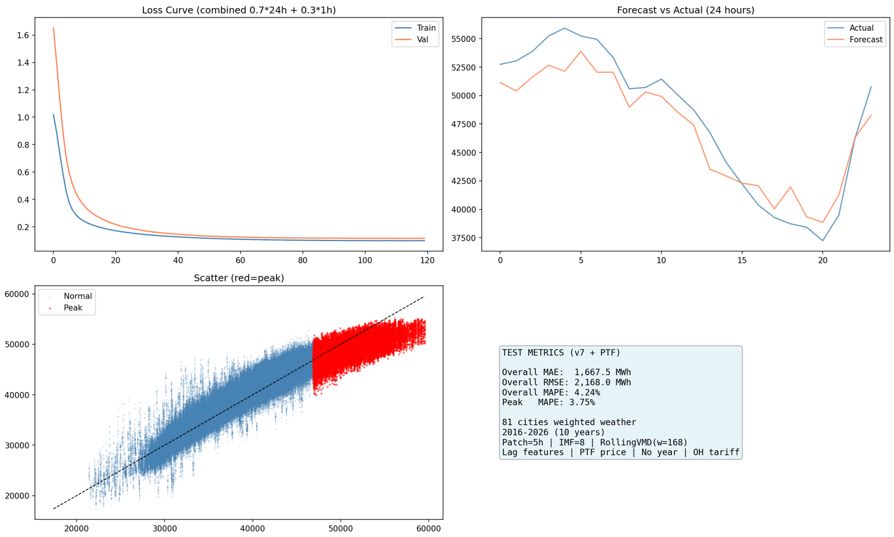

# PatchTST + Rolling VMD for Turkey Electricity Load Forecasting

A model that forecasts hourly electricity consumption across Turkey. It uses VMD (Variational Mode Decomposition) to decompose the load signal first, then a PatchTST style transformer to predict both the next 24 hours and the next single hour. It also uses PTF (day ahead market price) and population weighted weather data for 81 provinces as extra inputs.

## Results

| Metric | Value |
|---|---|
| Overall MAE | 1,667.5 MWh |
| Overall RMSE | 2,168.0 MWh |
| Overall MAPE | 4.24% |
| Peak hour MAPE (top 15%) | 3.75% |

Trained and tested on 10 years of hourly EPİAŞ (Turkish energy exchange) consumption data, 2016 to 2026.



## What it does

- **Rolling VMD**: decomposing the whole signal at once leaks future info into the past, so VMD runs in a sliding window instead (168h window, 24h step). Only the newly covered part of each window is kept, giving 8 causal IMFs.
- **Dual head PatchTST**: the same patch embedding and transformer encoder feeds two heads, a 1 hour head and a 24 hour head. The loss is a weighted mix of both (0.7 x 24h + 0.3 x 1h), which keeps the long horizon stable without hurting the short one.
- **Peak aware loss**: a Huber loss with extra weight on the top 15% (peak demand) and bottom 15% (valley demand) of samples, since those hours matter most operationally.
- **Lots of exogenous features**: weighted weather for 81 provinces (temperature, humidity, wind, GHI/DNI), Turkish holiday and tariff calendars, lag/rolling stats, and PTF price with its own lags.

## Architecture

```
Input window (168h x N features)
        │
   Patch Embedding (patch=5h, stride=1) + learned positional embedding
        │
   Transformer Encoder (3 layers, 8 heads, d_model=192, norm_first, GELU)
        │
        ├── 1h head  → single step forecast
        └── 24h head → 24 step forecast
```

## Data pipeline

1. **Load data**: hourly EPİAŞ consumption data (semicolon separated, Turkish decimal format), cleaned and parsed.
2. **Weather**: pulled per province from the [Open Meteo Archive API](https://open-meteo.com/), then combined into one national series weighted by each province's share of national consumption.
3. **PTF**: converted to TL/USD/log scale, with lag and rolling features added.
4. **Rolling VMD**: the load series is decomposed into 8 IMFs.
5. **Feature engineering**: calendar features (sin/cos encodings for hour/day/month, holidays including Ramadan, tariff periods), HDD/CDD, temperature interactions, lag/rolling stats for both load and price.
6. **Sequence building**: 168 hour lookback windows, normalized with StandardScaler, chronological 70/15/15 train/val/test split to avoid leakage.

## Repo structure

```
.
├── patchtst_rolling_vmd.ipynb   # data, training, evaluation, all in one
├── docs/                        # plots used in this README
└── README.md
```

> Built and run on Kaggle (GPU). Adjust the `/kaggle/input` and `/kaggle/working` paths if running locally.

## Config

| Group | Setting |
|---|---|
| VMD | K=8, alpha=2000, window=168h, step=24h |
| Patch | patch_size=5h, stride=1, seq_len=168h, pred_len=24h |
| Transformer | d_model=192, n_heads=8, n_layers=3, dropout=0.25 |
| Training | batch_size=128, epochs=120, AdamW + cosine schedule with warmup, gradient clipping |
| Loss | Peak aware Huber (2x weight on top/bottom 15%) |

## Requirements

```bash
pip install torch numpy pandas scikit-learn matplotlib seaborn requests holidays vmdpy tqdm
```

The code falls back to CPU if no GPU is found, but you really want a CUDA capable GPU here. Rolling VMD plus 10 years of hourly data on CPU would be painful. If you don't have one, just run it on a cloud based platform like Kaggle (which is what this was built and trained on) or Google Colab, both give free CUDA GPU access.

## Usage

1. Put the EPİAŞ consumption CSV and PTF price CSV in the input folder (or point `EPIAS_PATH` / `PTF_PATH` to them).
2. Run the notebook top to bottom. Weather data is fetched automatically on first run and cached to disk.
3. Trained weights (`best_model.pt`), loss/forecast plots, and the attention map get written to the output folder.

## Notes

- Weather is modeled as a national weighted average, not per province, so it doesn't fully capture Turkey's regional climate differences.
- The 24h step in rolling VMD is a tradeoff between accuracy and speed. A smaller step is more accurate but much slower.
- This is a research project done as part of a bachelor's thesis, not a production forecasting system.

## Status

Being worked on toward a conference paper submission.
